# Low-Cost Plant-Based Meat Moisture Content Measurement Device Based on Raspberry Pi 4 B, Its Camera Module 3 NoIR, and a Halogen Lamp

This repository contains work conducted at the Optics and Photonics Laboratory at Niigata University by fourth-year Electronics, Information and Communication Engineering Program student Kostas Martynas Balciunas between 2025 and 2026 for his Bachelor's thesis. The purpose of this repository is to enable students and other individuals to recreate, use and potentially improve the moisture content measurement device that was developed during this period.

## The repository includes:
- Mechanical diagrams of the developed device  
- Software and programs used for the device and its measurement data analysis  
- Electrical circuit diagrams of the developed device  
- Additional materials to assist in recreating the device and the plant-based meat used

## Guide to those seeking to recreate the device:

1) Carefully read the Aim of this project, Basic theory behind the research, Current Results, and Future Work sections of this README.md file to understand the basic concepts of the developed measurement device and it's limitations.
2) Buy the necessary materials to build the measurement device (print the 3D model of the device and assemble the electrical circuits) and prepare the plant-based meat sample (other recipes for plant-based meat samples can also be used).
3) Set up your Raspberry Pi 4 B module (it may be possible to use other Raspberry Pi microcontrollers as well) and install the necessary libraries and software (refer to Programs).
4) Recreate the electrical circuits used in the measurement device (refer to Electrical Circuit Diagrams). Make sure they work as standalone circuits before connecting them to the microcontroller.
5) 3D print and construct the case for the measurement device (refer to Mechanical Diagrams). 3D printing the device is not necessary, since 2D diagrams are provided (Mechanical Diagrams/2D diagrams), and it is possible to recreate the device using cheaper materials such as cardboard or plywood. However, it is important to note that the precision of the measurement device may suffer due to the unevenness of individual components made by hand.
6) Install the electrical circuits and the Raspberry Pi Camera Module 3 NoIR into the case of the device.
7) Prepare the plant-based meat sample for the experiments (refer to Recipe of the plant-based meat used).
8) Conduct experiments and initial image processing using the user manual provided in the User Manual and Guide section of this repository.
9) Conduct comprehensive (batch) post-experiment image processing using Programs/Other Programs/apv_calculator.py.
10) Use other programs to visualize experiment results if necessary.
11) Learn, improve, and enjoy the process. If you notice any issues, make improvements or like to request for the actual data of the individual experiments conducted please contact the creator of this repository (contacts are listed at the bottom of this file).

## Aim of this project
Interest in alternative proteins such as plant-based meats has grown in recent years, but development remains concentrated in regions like North America and Europe due to the need for expensive facilities and equipment. This limits access for developing countries and institutions with restricted budgets, potentially hindering global progress in this field.

Moisture content is a key parameter affecting the texture, taste, and overall quality of plant-based meat products and is typically measured using costly equipment such as spectrometers. This project investigates the feasibility of a low-cost, Raspberry Pi-based imaging device for non-destructive, real-time moisture measurement during product development. It also explores the use of the same device to track changes in moisture content, size, and color over time, providing insight into the sample’s optical and physical properties.

## Basic theory behind the project

Water molecules are known to absorb electromagnetic radiation (light) over a wide range of the electromagnetic spectrum [1]. The relationship between wavelength and the corresponding absorption coeffcient is shown in Figure 1.

  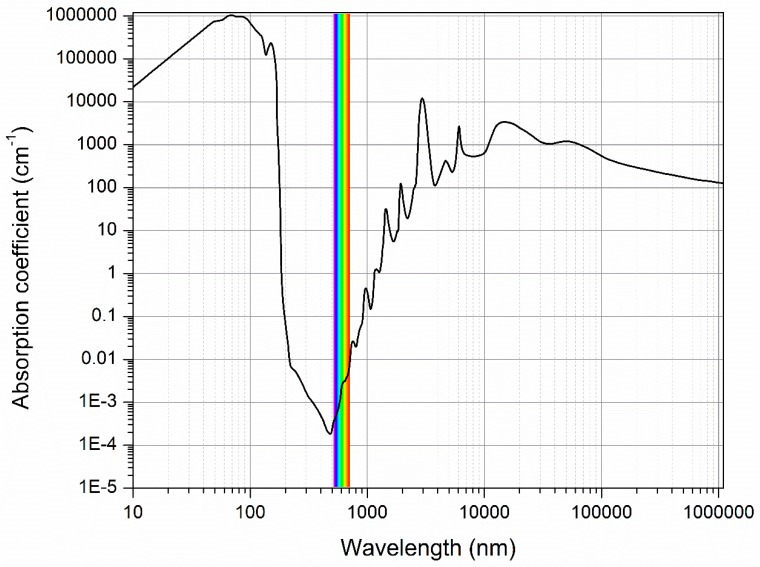

  <em>Figure 1. The water absorption spectrum[1].</em>

In the UV region (100 nm to 400 nm), as well as in the mid-IR (3 µm to 50 µm) and far-IR (50 µm to 1000 µm) regions, water exhibits strong absorption. In the context of food analysis, such strong absorption limits measurements to very thin samples. If light of a particular wavelength entering a sample is absorbed by water to the point that the reflected intensity is very low, it becomes difficult to detect using low-cost equipment. In contrast, water absorption in the near-infrared (NIR;0.7 um to 3 um) region is signicantly weaker. As a result, sufficient transmitted intensity can be obtained even for thicker samples, enabling non-destructive analysis of whole plant-based meat products such as hamburger patties with minimal sample preparation. 

  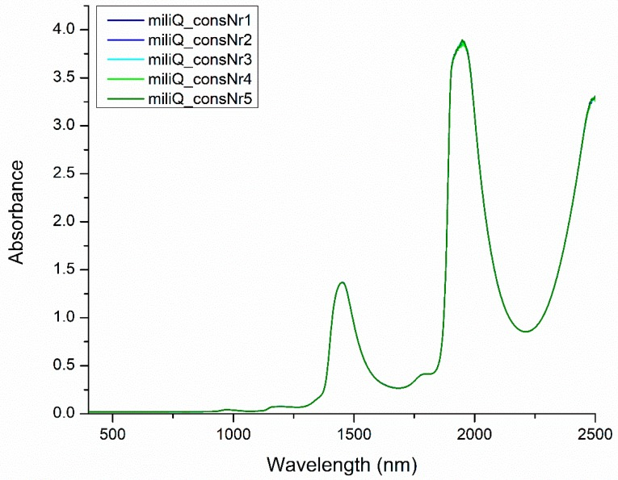

  <em>Figure 2. Near-infrared spectra of pure water[2].</em>

More than 500 water absorption bands have been identified in the wavelength range from 400 to 2500 nm [2], but only four main bands, located approximately at 970, 1190, 1450, and 1940 nm, are considered to contain signicant information about water structure (moisture)(Figure 2). Among these, the absorption band at approximately 970 nm is of particular importance to this research. Although its absorbance is lower than that of the other main bands, this wavelength
is relevant because some low-cost imaging sensors, such as the Raspberry Pi Camera Module 3 NoIR, are sensitive to wavelengths up to approximately 1000 nm [3]. 

If changes in moisture content affect reflected light intensity, and these changes are captured as variations in average pixel intensities (API) in JPEG images or average pixel values (APV) in RAW (DNG) images, then it may be possible to detect moisture changes using image data alone. 

A low-cost device consisting of a Raspberry Pi 4 B microcontroller, its Raspberry Pi Camera Module 3 NoIR, and other readily available components is proposed for this purpose. If a decrease in moisture content (due to evaporation) consistently corresponds to an increase in pixel intensities or values, this would indicate that the device can be used for moisture analysis.

## Current Results

Figures 3 to 5 show the developed moisture measurement device.The body of the device was fabricated using a 3D printer (Creality K1). It was printed in multiple parts using black 1.75 mm diameter PLA filament (Creality Ender, 3D PLA BLACK 1.75 mm) and assembled using screws or adhesive. The device incorporates a light source consisting of a 4.8 V, 0.5 A halogen lamp (HL) (National, Halogen Miniature Lamp MB-48M5H), which emits both visible and NIR light. A white plastic cap (CP) obtained from a PET bottle and assumed to be made out of either polyethylene or polypropylene was affixed above the lamp to scatter the emitted light. The scattered light is further dispersed using a Fresnel lens (FL) (CAN DO 100 yen shop, Card Magnifier, 2.5 × magnification) placed 4.0 cm from the halogen lamp and subsequently passed through an infrared transmittance filter (IRF) that absorbs wavelengths below 900 nm (FUJIFILM, Infrared Transmittance Filter IR90, 7.5 × 7.5). These optical components were housed inside a small enclosure with an adjustable angle. All experiments were conducted with the enclosure fixed at an angle of 33° relative to the base of the device. The FL was positioned as close as possible to the filter (at a distance of around 1 cm), with the infrared transmittance filter placed at the end of the enclosure facing the sample. The filter was positioned approximately 10 cm from the sample, measured along a line perpendicular from the center of the transmittance filter to the sample surface. The light source was controlled using the circuit described in Electric Circuit Diagrams.

  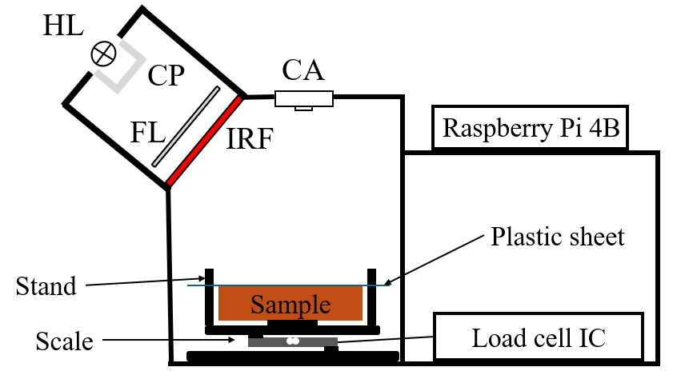

  <em>Figure 3. Simplified image of the developed device.</em>

  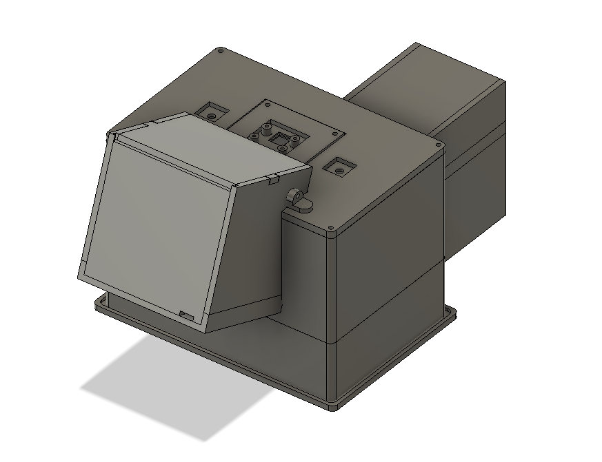

  <em>Figure 4. 3D CAD model of the developed device.</em>

  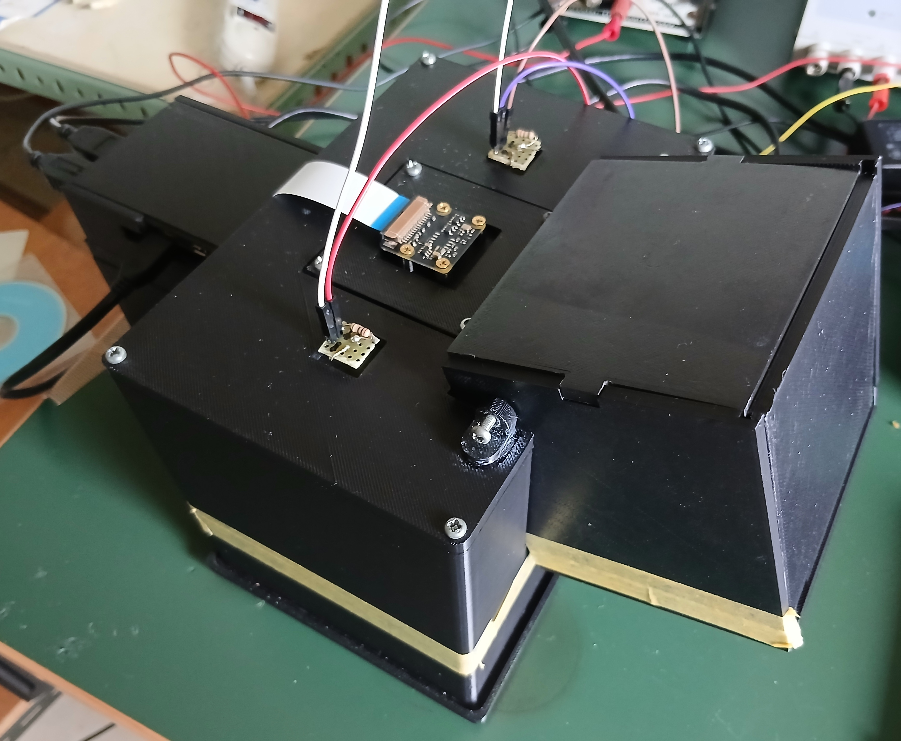

  <em>Figure 5. Assembled developed device.</em>

The Raspberry Pi Camera Module~3 NoIR (CA) was positioned directly above the sample location at an approximate distance of 9 cm from the sample surface. CA was mounted using screws and placed in close proximity to the microcontroller, which was also secured using screws. Although not shown in diagram, two white LEDs were installed to the left and right of the camera and were controlled by the microcontroller. These LEDs were used to monitor color changes in the sample. Additional plastic caps were attached to each LED to diffuse their emitted light.

The sample was placed on a scale constructed using a 500 g capacity load cell (Sensorcon, Micro Type Load Cell SC616C) , a 3D-printed black plate and an HX711 chip-based AD converter module (Akitsuki Denshi, AE-HX711-SIP) for signal acquisition. The module and its associated circuitry were housed inside an enclosure attached to the main sample chamber. It is important to note that the scale is only used for the initial experiments and the calibration of the device and is not supposed to be used when the device is fully developed.

An additional platform as shown in Mechanical Diagrams/2D diagrams/SCALE/S6.PNG was later introduced on top of the scale to allow the sample to dry from its bottom surface rather than from its upper surface. This platform was designed in such a way that a piece of translucent plastic cut from a file holder could be placed over the plant-based meat sample and fixed in place.

Many experiments were conducted using the developed moisture measurement device and plant-based meat samples. Two of these experiments are presented here.

### Experiment with the plant-based meat sample without the translucent plastic cover

This experiment was conducted using a plant-based meat sample with its surface uncovered in a dark room under controlled ambient conditions. The temperature was maintained at 24°C, and the experiment took place during dry weather conditions in Niigata, Japan, in January. To minimize the influence of stray light, the device shown in Figure 5 was covered with an additional cardboard enclosure. For the same reason, the monitor used to control the Raspberry Pi microcontroller was oriented away from the device. The mass of the sample was measured using the integrated scale both before and after the experiment, while maintaining identical measurement settings.

The experiment lasted 380 minutes and consisted of 20 cycles acquired at 20-minute intervals. Noise, LED-illuminated, and halogen lamp-illuminated images of the sample were captured in both DNG and JPEG formats, and the corresponding image metadata were stored. The exposure time was set to 150,000 μs, the analogue gain to 1.0, the colour gains to (1.0, 1.0), and the lens position to 10.0. Both AfState and AeState were set to False.

The initial mass of the sample was 34.01 g. Based on the Moisture Content Calculator described in the relevant section, the initial water content of the sample was estimated to be between 18.55 and 19.08 g. The mass of the sample decreased to 32.80 g by the end of the experiment, corresponding to a mass loss of approximately 1.20 g (with an estimated mass loss rate of 0.0032 g/min). Changes in APV over time were evaluated for the region inside the sample, the region outside the sample, and the total image area excluding the shrinkage region. Edge detection was performed using the parameter settings listed in Table 1 with the program described in Programs/Other Programs/apv_calculator.py. These settings were kept constant for all images across all experimental cycles.

  <em>Table 1. Settings applied to the processed experimental images of a plant-based sample without the plastic cover.</em>

| Setting                  | Value   |
|--------------------------|---------|
| Gaussian kernel          | (3, 3)  |
| Sigma x                  | 0       |
| Thresholding value (min) | 44      |
| Thresholding value (max) | 255     |
| Edge kernel              | (3, 3)  |
| Minimum area             | 147762  |
| Maximum area             | 9000000 |

  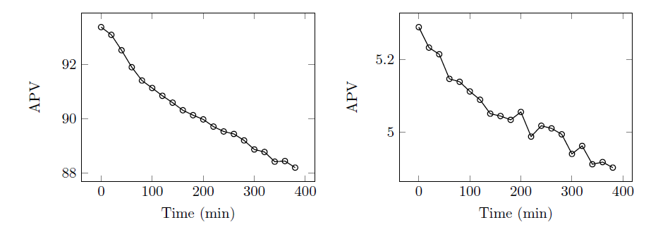

  <em>Figure 6. APV of the total area of the RAW image(left) and the area outside the sample(right)(no plastic cover).</em>

  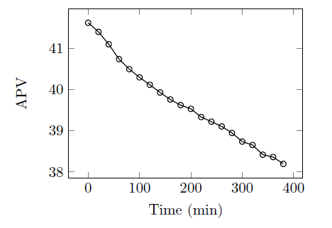

  <em>Figure 7. APV of the area inside the sample(no plastic cover).</em>

As shown in Figures 6 and 7, the decrease in sample mass resulted in a decrease in APV across all analyzed image regions, contrary to the previously stated hypothesis. The initial APV of the area inside the sample was 93.38 and decreased by approximately 5.54% to 88.21, at a rate of 0.01361 (a.u.)/min (Figure 6, left). Figure 6 (right) shows that the APV of the area outside the sample decreased from 5.28 to 4.90, corresponding to a reduction of 7.31% at a rate of 0.001 (a.u.)/min, although transient increases in APV were observed at t = 200 min, t = 240 min, and t = 320 min. The APV of the total area, with the shrinkage region excluded, decreased from 41.62 to 38.20, representing a reduction of 8.22%, with an approximate rate of 0.009 (a.u.)/min.

  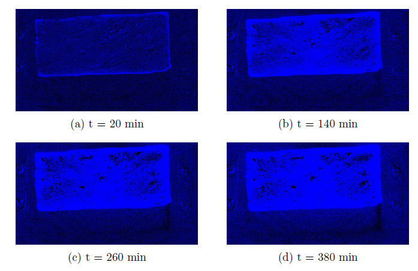

  <em>Figure 8. Darkened areas of the plant-based sample at different times(no plastic cover).</em>

  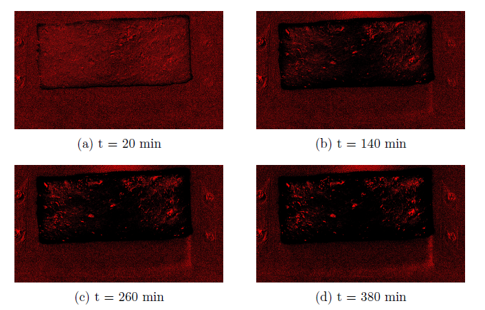

  <em>Figure 9. Brigthened areas of the plant-based sample at different times(no plastic cover).</em>

Using Programs/Other Programs/sample_diff_img_generator.py, the spatial distribution of brightness changes in the sample over time was analyzed. The resulting color-mapped images are shown in Figures 8 and 9. Blue regions indicate areas that became darker (decreased in pixel intensities) relative to the initial (reference) image, while red regions indicate areas that became brighter (increased in pixel intensities). The results show that the surface of the sample became significantly darker over time, particularly near the edges and in the central region. Brighter regions were still observed in and around the sample, but their intensity and spatial extent were less prominent throughout the experiment.

### Experiment with the plant-based meat sample with the translucent plastic cover

To mitigate physical and optical changes (hardening and browning of the surface) in the plant-based meat, a thin translucent plastic sheet was introduced. The sheet was cut from a standard file holder and placed directly on the sample surface without gaps, ensuring full contact. It was secured using screws while applying minimal pressure to avoid deformation or bending of the sample.

The experiment with the translucent plastic sheet in place was conducted under dry weather conditions (December in Niigata, Japan), using the same environmental conditions described previously and a sample with an initial mass of 30.29 g and otherwise nearly identical parameters. The initial water content of the sample was estimated to be between 16.52 and 16.99 g. After 380 minutes, the sample mass decreased to 29.47 g, corresponding to a total mass loss of approximately 0.82 g and an average mass loss rate of approximately 0.0022 g/min. The edge detection parameters used in this experiment are summarized in Table 2.

  <em>Table 2. Settings applied to the processed experimental images of a plant-based sample(with the plastic cover).</em>

| Setting                  | Value   |
|--------------------------|---------|
| Gaussian kernel          | (3, 3)  |
| Sigma x                  | 0       |
| Thresholding value (min) | 45      |
| Thresholding value (max) | 255     |
| Edge kernel              | (3, 3)  |
| Minimum area             | 147762  |
| Maximum area             | 9000000 |

  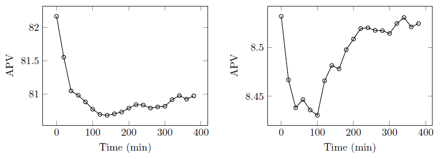

  <em>Figure 10. APV of the total area of the RAW image(left) and the area outside the sample(right)(with the plastic cover).</em>

  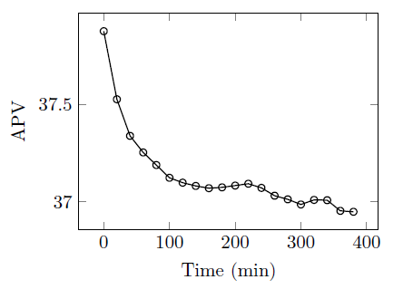

  <em>Figure 11. APV of the area inside of the sample(with the plastic cover).</em>

  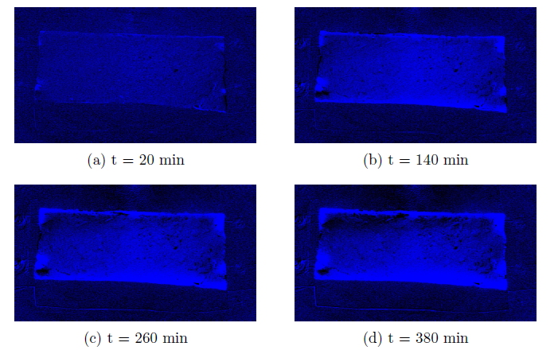

  <em>Figure 12. Darkened areas of the plant-based sample at different times(with the plastic cover).</em>

  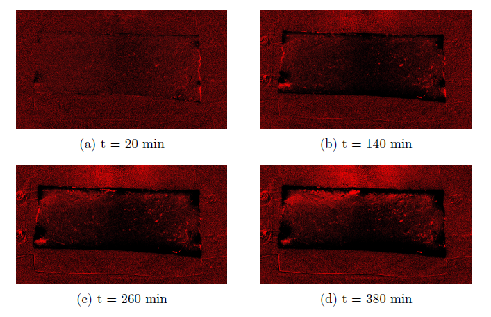

  <em>Figure 13. Brigthened areas of the plant-based sample at different times(with the plastic cover).</em>

## Future Work
These are the areas in which the device could potentially be improved:

- Multiple programs used in this research could be combined into a single GUI-based application. This software could be extended to automatically optimize image acquisition and processing parameters, for example by using machine learning techniques.

- Further analysis and experiments are required to determine which regions of the images (inside the sample, outside the sample, or the total image area with shrinkage removed) provide the most valuable information for moisture estimation. It may be necessary to consider all regions to obtain reliable measurements.

- Currently, identical image processing parameters are applied to every experimental cycle, which may introduce errors. It is therefore necessary to evaluate how well the shrinkage area is detected throughout the experiment and potentially implement a time-based shrinkage area detection algorithm that adapts to optical changes in the sample surface due to moisture loss.

- The experimental workflow (capture.py) could be improved by first capturing images at higher shutter speeds (for edge detection) and then at lower speeds only for APV calculations (moisture analysis).

- The correlation between shutter speed (exposure time) and changes in APV/moisture content loss (measured using the HX711-based scale) should be analyzed. There may be an optimal shutter speed at which moisture content changes are most accurately evaluated.

- The weight scale and the algorithm used to acquire measurements should be improved, as the current setup does not provide accurate results. In many experiments, the sample weight increased during the initial hours, which is unlikely under dry winter conditions (December–January in Niigata). This may be due to faulty wiring, measurement drift, or issues in the capture.py pipeline (Programs/Capture Software/capture.py).

- The correlation between changes in APV in different regions of the sample and changes in sample weight should be analyzed (after resolving the scale-related issues).

- The mechanical design of the device could be improved to make it more compact, easier to assemble, and better at preventing stray light from entering the sample chamber.

- The electronics (circuit boards, jumper wires, etc.) could be reorganized to fit more neatly, be shorter, and be easier to remove.

- The distances between the halogen lamp, Fresnel lens, infrared transmittance filter, and the sample were not optimized. Further experiments are required to determine the optimal configuration, as well as the optimal distance between the camera and the sample.

- Different low-cost light sources, such as ~940 nm NIR LEDs, halogen-tungsten lamps, or halogen lamps with different power ratings, could be evaluated to determine their effect on measurement results and to identify the most suitable illumination source.

- Multiple light sources positioned at different angles could also be tested to assess their effect on measurement results, although this would require additional power supplies. Multiple visible light filters could also be used to further reduce the influence of visible and stray light.

- Different plant-based meat recipes can be explored. These may include ingredients such as chickpea flour, soy protein isolate, pea protein isolate, rice protein isolate, tofu, okara (soy pulp remaining after tofu or soy milk production), as well as various root vegetables and legumes. The proposed device could be further developed and calibrated for such variations.

- A more user-friendly manual and repository could be developed to make this project more accessible to people with different backgrounds :P

## References
[1] Muncan, J., Tsenkova, R. Aquaphotomics|From Innovative Knowledge to Integrative Platform
in Science and Technology. Molecules, 24(15), 2742. https://doi.org/10.3390/molecules24152742 , (2019).

[2] Tsenkova, R., Kovacs, Z., Kubota, Y. Aquaphotomics: Near Infrared Spectroscopy and
Water States in Biological Systems. Sub-cellular biochemistry, 71, 189{211, https://doi.org/10.1007/978-3-319-19060-0_8, (2015).

[3] J. Howell, B. Flores, J. Naranjo, A. Mendez, C.C. Vera, C. Koumriqian, J. Jordan, P.
Neethling, C. Groenewald, M. Lovemore, P. Kinsey, T. Kruger. Raspberry Pi multispectral
imaging camera system (PiMICS): a low-cost, skills-based physics educational tool.
10.48550/arXiv.2412.04679, (2024).

## For more additional information, questions or suggestions please contact:

Graduate of Niigata University Kostas Martynas Balciunas (kostbal55@gmail.com)

Professor Samuel Choi, Optics and Photonics Laboratory, Niigata University Samuel Choi (schoi@eng.niigat-u.ac.jp)
