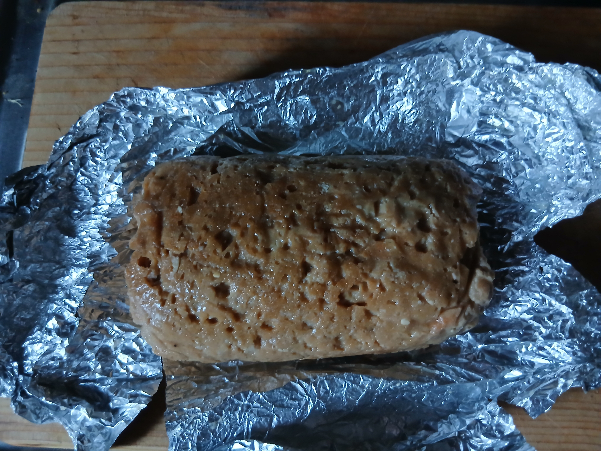

# Plant-based meat recipe that was used to make the samples for the experiments

## Ingredients used

- Wheat gluten flour (nichie Wheat Gluten Flour, [https://www.amazon.co.jp/dp/B07FSFBTZH?ref=ppx_yo2ov_dt_b_fed_asin_title])
- Miso paste (Hikari Miso, Craft Miso, Nama-Koji, [bought at a local supermarket])
- Nutritional yeast (Arisan Nutritional Yeast, [https://www.amazon.co.jp/-/en/%E3%82%A2%E3%83%AA%E3%82%B5%E3%83%B3-Arisan-Nutritional-Yeast-200g/dp/B00P1XJ4RG?th=1])
- Minced garlic [bought at a local supermarket]
- Negligible amounts of black pepper and paprika powder
- Tap water

## Ratio of ingredients used to prepare the plant-based meat loafs

| Ingredient           | Total ratio [%] | Water content [%]         |
|----------------------|------------------|----------------------------|
| Wheat gluten flour  | ~43.0            | 4.80–7.40 [1]                 |
| Miso paste           | ~5.00            | 38.50–44.90 [2]               |
| Garlic               | ~0.70            | 64.37–80.07 [3]               |
| Nutritional yeast    | ~1.60            | 8.00 [4]                       |
| Water                | ~49.7            | 100.0                      |
| Black pepper         | < 0.1            | Negligible                 |
| Paprika powder       | < 0.1            | Negligible                 |

For example, in this research two cilinder-shaped loaves were produced using 350 g of gluten, 40 g of miso paste, 6 g of garlic, 13 g of nutritional yeast, and 413 g (ml) of water. Each loaf weighed approximately 400 g and yielded 4 to 6 samples of around 30 g each, with dimensions of 8 cm (length) x 3 cm (width) x 1 cm (thickness). The samples were rectangular in shape and did not have rounded edges.

The sample was prepared in a regular kitchen using the following procedure:

1) The dry ingredients (wheat gluten , nutritional yeast, and negligible amounts of black pepper and paprika powder) were mixed thoroughly in a large bowl.

  

  <em>Figure 1. Dry components used in the preparation of the plant-based meat sample.</em>

2) Minced garlic and miso paste (Hikari Miso, Craft Miso, Nama-Koji) were then added to warm water and stirred until the miso paste was fully dissolved.

3) The wet and dry ingredients were subsequently combined to form a dough.

  

  <em>Figure 2. Dough that was formed by compining the dry and wet ingredients.</em>

4) The dough was then shaped into loafs and wrapped in aluminum foil lightly coated with olive oil.

  

  <em>Figure 3. Loaf that was lightly coated with olive oil.</em>

  

  <em>Figure 4. Loaf wrapped in aluminium foil.</em>

5) The loafs were then steamed for one hour (30 minutes on each side) and allowed to cool for several hours before being either refrigerated or frozen.

  

  <em>Figure 5. Steaming of the plant-based meat.</em>

6) The cooked loafs were then either frozen or stored in a refrigerator for up to a week.

  

  <em>Figure 6. Cooked loaf of the plant-based meat.</em>

7) On the day of the experiments a 8 cm(lenght) x 3 cm(width) x 1 cm(thickness) rectangle-shaped sample that weighed between 30 and 35 grams was cut from inside of the cooked loaf using a regular kitchen knife and stored inside of a sealed plastic bag until the start of the experiment.

  

  <em>Figure 7. Plant-based meat sample used in the experiments.</em>

## References
[1] Schopf, M., Wehrli, M.C., Becker, T. et al. Fundamental characterization of wheat gluten. Eur Food Res Technol 247, 985–997, https://doi.org/10.1007/s00217-020-03680-z, (2021).

[2] Okouchi, R., Sakanoi, Y., Tsuduki, T. Miso (Fermented Soybean Paste) Suppresses Visceral Fat Accumulation in Mice, Especially in Combination with Exercise. Nutrients, 11(3), 560, https://doi.org/10.3390/nu11030560, (2019).

[3] Sunanta, P., Pankasemsuk, T., Jantanasakulwong, K., Chaiyaso, T., Leksawasdi, N., Phimolsiripol, Y., Rachtanapun, P., Seesuriyachan, P., Sommano, S. R. Does Curing Moisture Content Affect Black Garlic Physiochemical Quality? Horticulturae, 7(12), 535,  https://doi.org/10.3390/horticulturae7120535, (2021).

[4] Jach, M. E., Serefko, A., Ziaja, M., Kieliszek, M. Yeast Protein as an Easily Accessible Food Source. Metabolites, 12(1), 63, https://doi.org/10.3390/metabo12010063, (2022).
