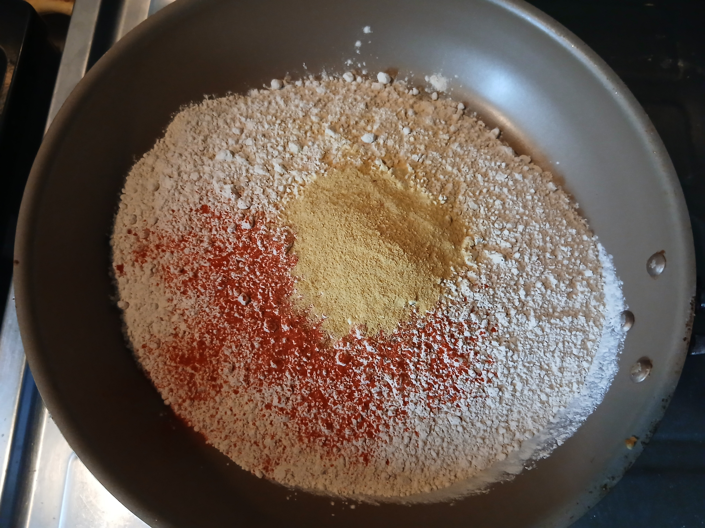
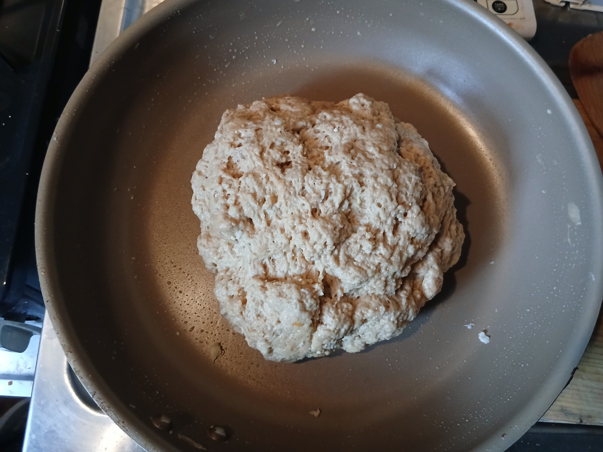
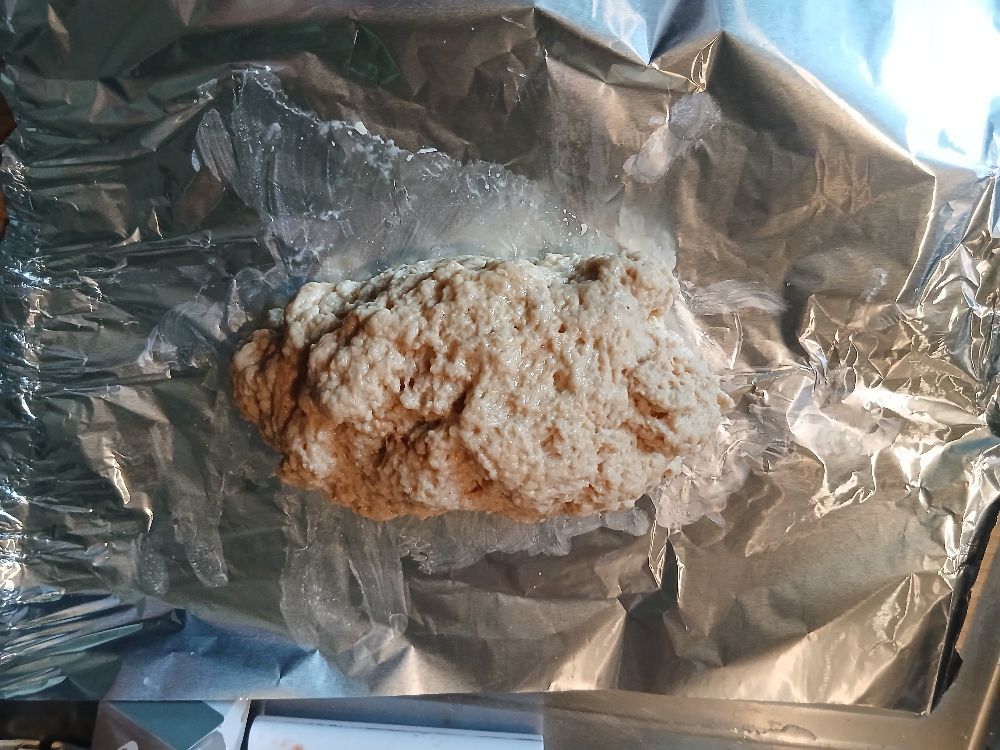
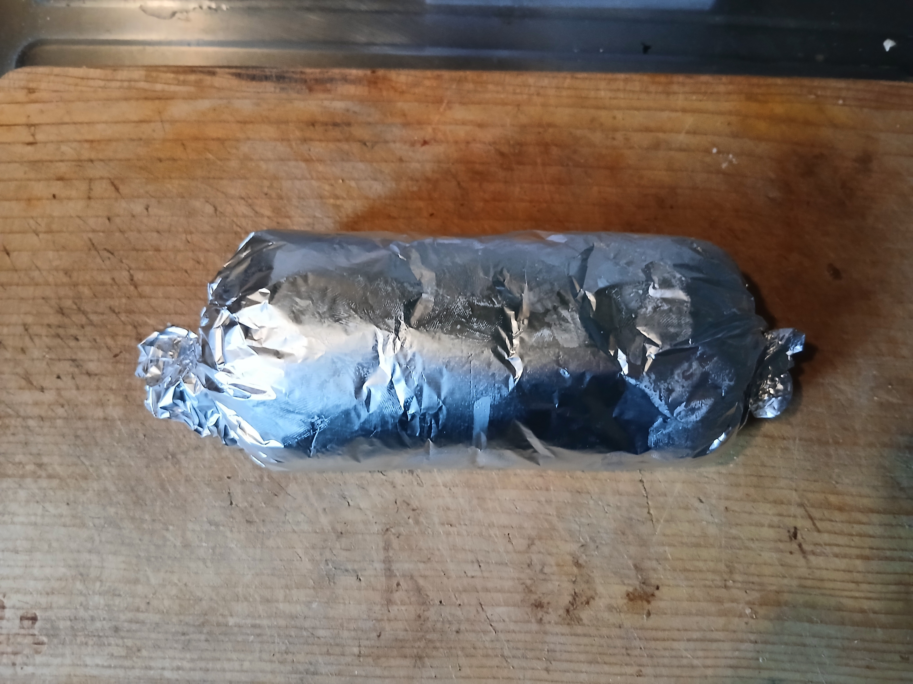
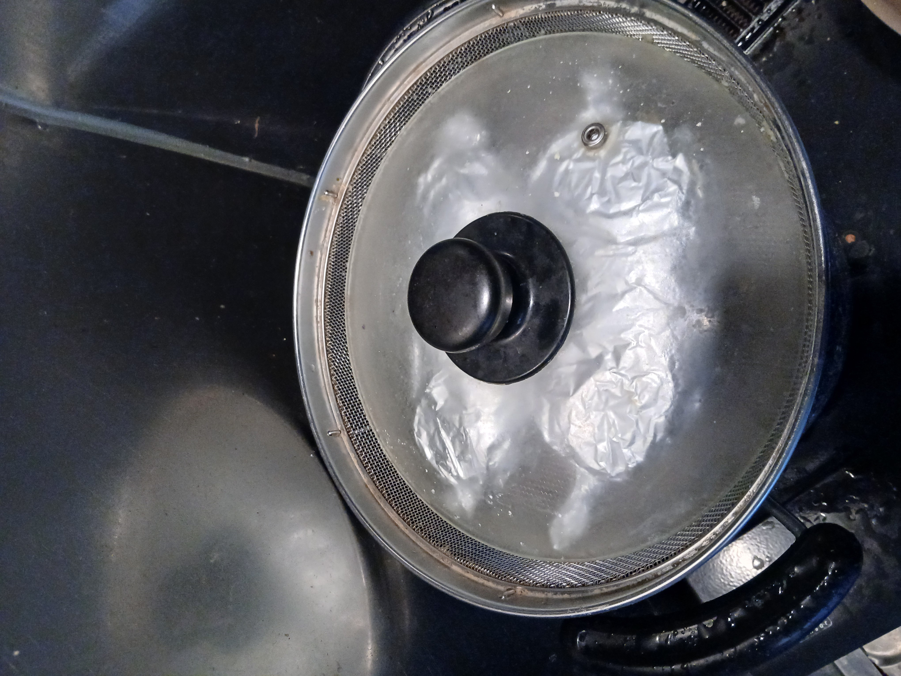

## Plant-based meat recipe that was used to make the samples for the experiments

# Ingredients used

- Wheat gluten flour (nichie Wheat Gluten Flour, [(https://www.amazon.co.jp/dp/B07FSFBTZH?ref=ppx_yo2ov_dt_b_fed_asin_title)])
- Miso paste (Hikari Miso, Craft Miso, Nama-Koji, [bought at a local supermarket])
- Nutritional yeast (Arisan Nutritional Yeast, [https://www.amazon.co.jp/-/en/%E3%82%A2%E3%83%AA%E3%82%B5%E3%83%B3-Arisan-Nutritional-Yeast-200g/dp/B00P1XJ4RG?th=1])
- Minced garlic [bought at a local supermarket]
- Negligible amounts of black pepper and paprika powder
- Tap water

# Ratio of ingredients used to prepare the plant-based meat loafs

| Ingredient           | Total ratio [%] | Water content [%]         |
|----------------------|------------------|----------------------------|
| Wheat gluten powder  | ~43.0            | 4.80–7.40                  |
| Miso paste           | ~5.00            | 38.50–44.90                |
| Garlic               | ~0.70            | 64.37–80.07                |
| Nutritional yeast    | ~1.60            | 8.00                       |
| Water                | ~49.7            | 100.0                      |
| Black pepper         | < 0.1            | Negligible                 |
| Paprika powder       | < 0.1            | Negligible                 |

The sample was prepared in a regular kitchen using the following procedure:

1) The dry ingredients (wheat gluten , nutritional yeast, and negligible amounts of black pepper and paprika powder) were mixed thoroughly in a large bowl.

  

  <em>Figure 1. Dry components used in the preparation of the plant-based meat sample.</em>

2) Minced garlic and miso paste (Hikari Miso, Craft Miso, Nama-Koji) were then added to warm water and stirred until the miso paste was fully dissolved.

3) The wet and dry ingredients were subsequently combined to form a dough.

  

  <em>Figure 2. Dough that was formed by compining the dry and wet ingredients.</em>

4) The dough was then shaped into loafs and wrapped in aluminum foil lightly coated with olive oil.

  

  <em>Figure 3. Loaf that was lightly coated with olive oil.</em>

  

  <em>Figure 4. Loaf wrapped in aluminium foil.</em>

5) The loafs were then steamed for one hour (30 minutes on each side) and allowed to cool for several hours before being either refrigerated or frozen.

  

  <em>Figure 5. Steaming of the plant-based meat.</em>

6) The loafs were then either frozen or stored in a refrigerator for up to a week.

7) On the day of the experiments a 8 cm(lenght) x 3 cm(width) x 1 cm(thickness) rectangle-shaped sample was cut from inside of this sample using a regular kitchen knife.

 
